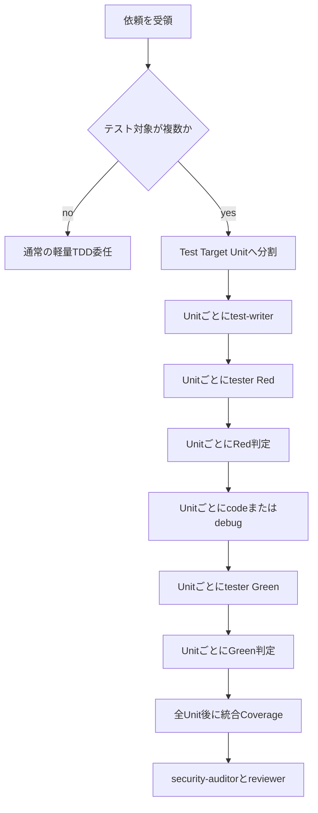

# 複数テスト対象の1ファイル単位分割委任設計

## 目的

テスト対象が複数ある依頼を、Orchestrator が1つの大きな test-writer / tester 委任へまとめず、対象テストファイルごとの独立した軽量TDD単位へ分割するためのプロンプト契約を定義する。

## Index Probe

- query: `RooCode custom modes test-writer tester all-agents yaml rules one file per test target`
- path: workspace root
- 主要候補: [rules/test-writer.yaml](../rules/test-writer.yaml:2), [rules/tester.yaml](../rules/tester.yaml:2), [all-agents.yaml](../all-agents.yaml:1783)

## 現行責務からの設計根拠

- [rules/test-writer.yaml](../rules/test-writer.yaml:21) は Red テスト作成専任で、編集対象をテストファイルだけへ限定する。
- [rules/test-writer.yaml](../rules/test-writer.yaml:24) は初手を Level 1 Contract Test または Level 2 Behavior Test に限定し、Level 4 Full TDD を初手にしない。
- [rules/test-writer.yaml](../rules/test-writer.yaml:25) はタスク開始時の新規テストを最大3個に制限する。
- [rules/test-writer.yaml](../rules/test-writer.yaml:31) は Goal / Files / Context Delta / Code Scope / Done / TDD Level / Test Classification / Initial Test Count などの委任情報照合を求める。
- [rules/tester.yaml](../rules/tester.yaml:21) は指定検証コマンド実行と Artifact Path 保存だけを責務にする。
- [rules/tester.yaml](../rules/tester.yaml:22) は Expected Red Signature、Coverage 85%以上、Failure Class、次工程判定を tester の責務外にする。
- [all-agents.yaml](../all-agents.yaml:1783) 以降は test-writer / tester の集約定義であり、個別 rule と同期させる必要がある。

## 設計方針

複数テスト対象とは、1つの依頼内で次のいずれかが2件以上存在する状態を指す。

- Edit Files に複数のテストファイルが含まれる。
- 1つのテストファイル内でも、独立した production target または external I/O boundary を複数検証する。
- Red確認コマンドが複数のテストファイル、複数の spec pattern、または複数の Artifact Path を必要とする。

この状態では、Orchestrator は委任を次の単位へ正規化する。

1. test-writer 委任は1回につき Edit Files のテストファイルを1件だけ持つ。
2. tester 委任は1回につき対象テストファイル1件に対応する検証コマンドと Artifact Path を1組だけ持つ。
3. consistency-checker の Red / Green / Coverage 判定も、原則として対象テストファイルごとの Artifact Path を入力にする。
4. 複数ファイル横断の Coverage 85%以上確認は、各ファイル単位の Green 後に統合 tester 委任として分離する。

## 責任分担

### Orchestrator

- 複数テスト対象を検出し、`Test Target Unit` 配列へ分解する。
- 各 `Test Target Unit` に対して test-writer → tester → consistency-checker → code/debug → tester → consistency-checker を順に投入する。
- 1つの委任に複数の Edit Files テストファイル、複数 Artifact Path、複数 Expected Red Signature を混在させない。
- 横断 Coverage 85%以上、security-auditor、reviewer は全 `Test Target Unit` 完了後に実行する。

### test-writer

- 1委任で1つのテストファイルだけを編集する。
- Initial Test Count はその1ファイル内で最大3個とし、複数ファイル合計で最大3個とは解釈しない。
- 対象ファイル外の test file、production file、依存設定を変更しない。
- Red成立、Coverage、次工程判定を行わない。

### tester

- 1委任で1つの対象テストファイルに対応するコマンドだけを実行する。
- stdout/stderr は1つの Artifact Path へ保存する。
- Coverage Artifact Path は、その委任で Coverage を明示された場合だけ返す。
- 失敗理由や Expected Red Match を本文で分類しない。

### consistency-checker

- test-writer 成果物は対象テストファイル単位で output-contract 判定する。
- tester Artifact は対象テストファイル単位で test-red / test-green 判定する。
- 統合 Coverage Artifact が渡された場合だけ Coverage 85%以上を判定する。

## インターフェース契約

### Test Target Unit

| Field | Required | Meaning |
|---|---:|---|
| `id` | yes | `test-target-001` のような安定ID |
| `testFile` | yes | 1委任で編集または実行するテストファイル1件 |
| `productionTarget` | yes | テストが固定する production file / API / boundary |
| `tddLevel` | yes | 初手は Level 1 または Level 2。既知バグだけ Level 3 |
| `testClassification` | yes | contract / behavior / regression / exploratory のいずれか |
| `initialTestCountMax` | yes | 対象テストファイル内で最大3 |
| `expectedRedSignature` | yes | 対象テストファイル単位の Red 失敗条件 |
| `redCommand` | yes | 対象テストファイルだけを実行するコマンド |
| `redArtifactPath` | yes | `artifacts/test-results/<id>-red.log` |
| `greenCommand` | yes | 対象テストファイルだけを再実行するコマンド |
| `greenArtifactPath` | yes | `artifacts/test-results/<id>-green.log` |
| `coverageCommand` | optional | 統合または対象単位 Coverage コマンド |
| `coverageArtifactPath` | optional | Coverage 85%以上判定に使う Artifact Path |

### test-writer 委任テンプレート制約

- Files の Edit Files は `testFile` 1件だけにする。
- Forbidden Files には他の test target のテストファイルと production file を含める。
- Context Delta には `Test Target Unit: <id>`、`TDD Level`、`Test Classification`、`Initial Test Count` を含める。
- Expected Red Signature は対象テストファイルの失敗名または未実装エラー1〜2件だけに固定する。

### tester 委任テンプレート制約

- Command は `redCommand` または `greenCommand` の1件だけにする。
- Artifact Path は `redArtifactPath` または `greenArtifactPath` の1件だけにする。
- 複数ファイル glob や全テスト実行は、単体 Red / Green フェーズでは禁止する。
- 統合 Coverage フェーズだけ、全体 Coverage 用の別 `coverageCommand` を許可する。

## 分割アルゴリズム

## all-agents.yaml 同期方針

- [rules/test-writer.yaml](../rules/test-writer.yaml:20) と [all-agents.yaml](../all-agents.yaml:1801) の test-writer 役割説明へ同じ分割契約を追加する。
- [rules/tester.yaml](../rules/tester.yaml:20) と [all-agents.yaml](../all-agents.yaml:1869) の tester Artifact Handoff へ同じ1ファイル実行契約を追加する。
- Orchestrator 側の委任規約が存在する場合は、複数 Test Target Unit の検出と分割を Orchestrator の責務として追記する。
- 実装YAML更新時は rule 個別ファイルを先に更新し、[all-agents.yaml](../all-agents.yaml:1783) の対応ブロックへ同一文意で同期する。

## 矛盾回避

- test-writer は複数 target を見つけても自分で分割委任せず、Failure Summary で Orchestrator へ戻す。
- tester は複数 Artifact Path や複数コマンドを渡されたら実行せず Failure Summary を返す。
- Coverage 85%以上は単体 Red フェーズの Done に含めず、全 Unit Green 後の統合 Coverage Gate で扱う。
- exploratory test を許可した場合は、その Unit 完了時点で contract / behavior / regression へ昇格または削除する。

## 受け入れ条件

- 設計契約により、複数テスト対象の初手 test-writer 委任が1テストファイル単位へ分割される。
- tester が1委任1コマンド1 Artifact Path を維持し、ログ全文や判定を返さない。
- [all-agents.yaml](../all-agents.yaml:1783) と個別 rule の同期対象が明確である。
- 後続実装時の品質ゲートとして Coverage 85%以上、security-auditor、reviewer が残る。
